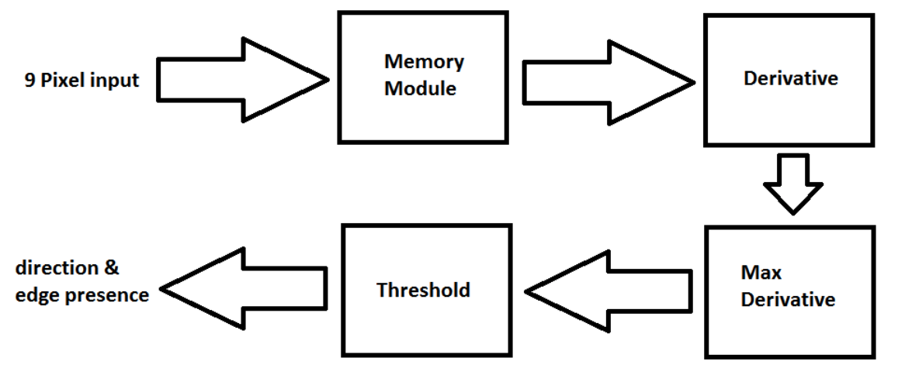
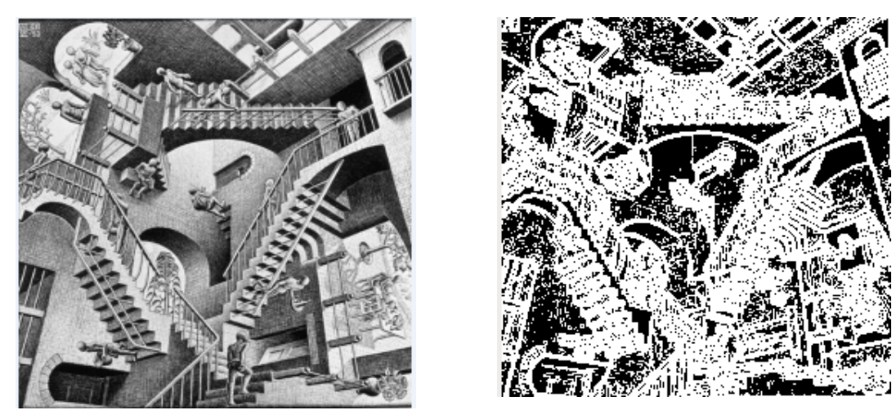

# Project Title

VHDL Sobel Edge Detector

## Description

The objectives of this project are to design a sobel edge detector using Mentor Graphics IC program, extracting netlist from a physical layout using Calibre, and performing simulations to see the effect of physical design choices on performance. This project is a capstone to the mentor graphics program family, which implements the process of VHDL code to schematic to layout. The ability to code a complex circuit in VHDL without introducing latches is tested as the code must be synthesizable. The ability to diagnose and debug post-synthesize the post-synthesis simulation in Questasim and post-layout circuit in ezwave is also tested. The objectives were accomplished as the final stage of the project, simulating the post-layout circuit in ezwave and applying the sobel edge detection to 4 different pictures was successful.

The design of sobel edge detection is sophisticated and can be design in a modular manner by breaking down into two main components, memory and calculation unit. While the memory component consists of only one module, the calculation module can be broken down further into three sub-components. Each of these subcomponents is associated with the three steps to calculating the presence and direction of an edge as given in the project directions. These steps are to calculate the derivatives along the four orientations of NE/SW, N/S, E/W, and NW/SE, calculate the value and direction of the maximum derivative as well as the absolute value of the derivative perpendicular to the maximum derivative, and to determine if the maximum derivative is above a threshold. All of the components and subcomponents are coded behaviorally with the overall control unit coded structurally, which utilizes all of the forementioned components and subcomponents. Another component utilized is the state machine, which serves as an overseer of the other components and serves only to report the current state of processing and when the output is read to be read.

The first module encountered is the memory module. Since the sobel-edge detection unit receives only a single 8-bit pixel when the i_valid signal is high, the unit must be able to store the first eight 8-bit pixels until the 9th pixel is received. The key idea of the memory module is the program counter, PC, which is incremented for every pixel received (when i_valid has a rising edge).  The number of the pixel received determines the value of the PC, which determines where to place the received 8-bit pixel data into the larger 72-bit output vector. When the last pixel is received, the PC is reset to 0 and the 1-bit signal mem_status is set high, which signals that the 9 pixels have been received and the unit can move on the calculations.

On the receiving end of derivative subsystem is the max derivative system that finds the maximum derivative, the max derivative direction and the derivative value for the perpendicular direction. Four 11-bit standard logic vectors representing directional derivative values are received as inputs. On the output side, the maximum directive and the derivative in the perpendicular direction are decoded as 11 bit standard logic vectors. A 3-bit signal representing the direction of the edge is also part of the outputs. The system first figures out the maximum derivative values and its direction. Then the derivative value perpendicular to the direction is located and sent to the output.

Once the max derivative sub-component has finished processing, the data moves on the final calculation sub-component, threshold.  The code in this sub-component consists of a single if-statement, which checks if the maximum derivative + derivative in the perpendicular direction/8 is equal or greater than 80. The addition of “/8” into the equation places less weight on the perpendicular direction and the value of 80 is arbitrary and thus can be set to any desired value. If the equality of the if-statement is met, then the control unit is informed that the nine pixels under test contains an edge, and the direction of the edge. Else, it will inform that there is no edge and set the direction to “000”. Once the if-statement is evaluated, this sub-component sets the 1-bit output signal calc_status to ‘1’, which signals that the calculation of the 9 pixels is completed.

Orchestrating all of the subsystems is the state machine. Its job is to determine the state of the whole system based on the inputs, and sends corresponding status to the output. Besides clock, reset, and valid as input signals, it also takes in the status from the memory module and calculation module. In terms of outputs, it has a 1-bit signal to indicate if an edge has been detected, and a 2-bit bus for showing the mode it is in. Two processes involving clock from the behavioral for the state machine. The first process determines the state to be in given the input. The second process decides what the output should be depending on the state it is in.

## Results

Test image 1 showed a cameraman taking a picture with a building in the background. The resulting picture resembled closely to the original picture, with the exception of some noise in the coat area and upper left corner of the picture where there should not be edges. The noise could be due to noise in the circuit or incorrect timing in the testbench.

Test image 2 showed the face of a monkey. The resulting picture resembled relatively close to the original picture. But the facial hair induced some noise into the result. The sobel machine struggled to detect the edges on facial hair. Despite that, features such as the eyes, the nose, and the eyebrows could still be identified.

Test image 3 showed a fighter jet flying over snowy mountains. The resulting picture resembled closely to the original picture and the sobel machine performed as expected. The original picture had text on the jet. The resulting text was somewhat observable. Overall, the silhouette of the fight jet could be distinguished from the mountains, and the cliffs could also be seen in the resulting picture.

Test image 4 twisted stairways inside a building. This picture put the sobel machine to the test because it had many angular and curved elements, which increase the number of edges in the picture. The resulting picture resembled somewhat closely to the original picture. The original picture had fine details of the stairs and rails. However, theses object became relatively vague after edge processing. Overall, the silhouette of the staircases could be distinguished and the shape of the building could also be seen in the resulting picture.

## Authors

* **David Lor** - *Initial work*
* **Kaiwen Zheng** - *Initial work* - [kaiwen2times](https://github.com/kaiwen2times)

## License

This project is licensed under the MIT License - see the [LICENSE.md](LICENSE.md) file for details

## Acknowledgments

* Hat tip to anyone who's code was used
* RIT CMPE-530 is a great class!
* GOT TIGERS!!!

